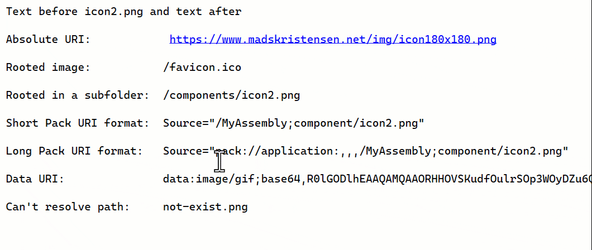

[marketplace]: https://marketplace.visualstudio.com/items?itemName=MadsKristensen.ImagePreview
[vsixgallery]: http://vsixgallery.com/extension/ImagePreview.3e89687a-7648-400e-aff7-a4fd71fd0f5c/
[repo]:https://github.com/madskristensen/ImagePreview

# Image Preview for Visual Studio

Download this extension from the [Visual Studio Marketplace][marketplace]
or get the [CI build][vsixgallery].

--------------------------------------

Shows an image preview when the mouse hover over any URL or file path string anywhere in any text file. 

!

### How can I help?
If you enjoy using the extension, please give it a ★★★★★ rating on the [Visual Studio Marketplace][marketplace].

Should you encounter bugs or if you have feature requests, head on over to the [GitHub repo][repo] to open an issue if one doesn't already exist.

Pull requests are also very welcome, since I can't always get around to fixing all bugs myself. This is a personal passion project, so my time is limited.

Another way to help out is to [sponsor me on GitHub](https://github.com/sponsors/madskristensen).
